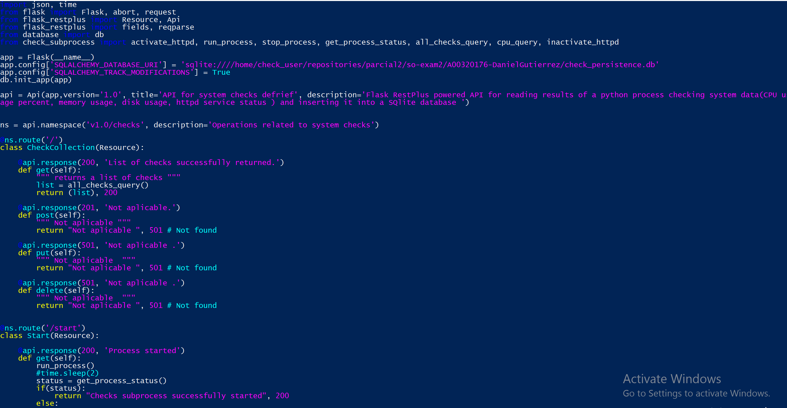

PARCIAL 2 -SISTEMAS OPERATIVOS

Repositorio : https://github.com/dgutierrez1/so-exam2  
Se tiene un scrip encargado de modelar la base de datos database.py
 
Este tiene la entidad Check con columnas que corresponden los necesarios (cpu, memoria, disco, y estado del servico httpd). Por un error al momento de almacenar la información en la base de datos, se usó una clase auxiliar en el script coercing.py para que convirtiera los String de formato UTF8  a Unicode. SQLAlchemy sugeria esta conversión para solucionar el problema de formatos de string.
 

El script encargado de todas las funciones el subproceso de crear un check cada 60 segundos es check_subprocess.py
 
  
  
Aquí se utilizan threading.Threads para poder enviar el proceso de checks a background y threading.Event para hacer que el hilo siga ejecutándose o pararlo como se desee. Se necesita usar un objeto de la clase threading.Event para hacer que el los hilos puedan parar y así el proceso lo podamos detener, porque, los hilo tiene tienen un método que los haga detenerse naturalmente. Al hilo sé que asigna un método (en este caso check_loop) y esta se ejecutara hasta que cambie el estado del threading.Event de nombre “active”. Este mismo “active” sirve para consultar si el proceso se está ejecutando. Los demás métodos son para hacer las consultas a la base de datos usando el objecto db o para ejecutar comandos para obtener la información necesaria del sistema. Se utilizó psutil para obtener toda la información del sistema excepto el estado del servicio de httpd. 
El api esta estructurada en check_api.py
 
 
 
Se tiene entonces las rutas del api para consultar todos los checks(v1.0/checks) y consultar un lista de solamente el cpu de los checks del tamaño deseado (v1.0/checks/cpu/history?size=0). Se tiene también dos rutas del api para iniciar el proceso de los los checks (v1.0/checks/start) y otro para detener ese mismo proceso  (v1.0/checks/stop), ambas usando el método GET. Iguamente desde el api se puede iniciar (v1.0/checks/start/httpd)  o detener (v1.0/checks/stop/httpd) el servicio de httpd, estas también a través del método GET. 
Al documentar el api con swagger se obtuve este resultado en el navegador

